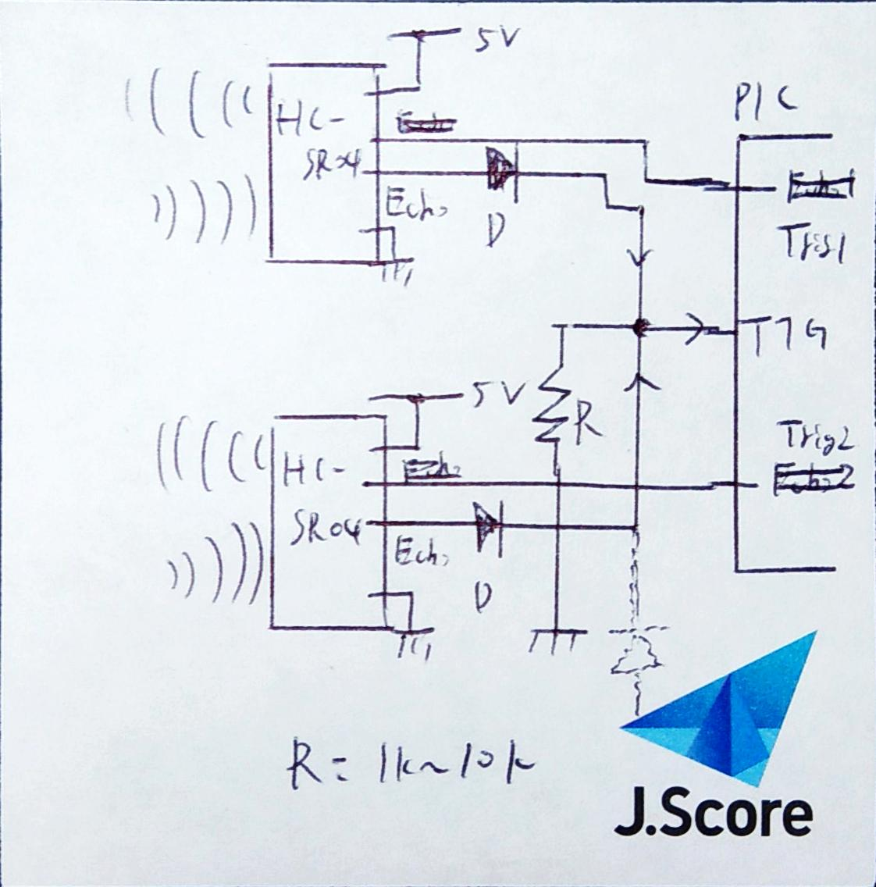

# Description of  HC_SR04 library for PIC

- ## About this library
    Ultra sonic sensor HC_SR04 library using PIC16F1 series   
    **This library can use only PIC which has 32MHz oscillator**

- ### What's about to HC_SR04
    [Datasheet](http://akizukidenshi.com/download/ds/sainsmar/hc-sr04_ultrasonic_module_user_guidejohn_b.pdf)

- ### Timer1 configration   
    |content|configuration of timer1|
    |---|---|
    |clock source | instruct clock(FOSC/4)|
    |prescaler    | 1:8|
    |count timing | ever 1us(1MHz) when triggered|
    |gate mode    | single pulse mode(counted only while highlevel added on trigger pin)|
    |gate source  | T1G pin|
    - ### Clock Flow
        [Internela RC Clock]  ---- 32MHz----> [Struct porescaler(1:4)] ----8MHz----> [Timer1 Prescaler(1:8)] ----1MHz----> [Timer1 count register\<TMR>]

- ## Required specification
    - must use system clock 32MHz
    - have 3 GPIO pins
    - Time1 **with gate control**

- ### Functions
    - #### Initialize Timer1 module and port for HC_SR04
        >void HC_SR04_Init(HC_SR04_Init_PORTTypedefHC_SR04_InitPort,HC_SR40_CONFIG_t *conf);   
        
        [InitPort]:Function pointer for initialize port of HC_SR04   
        [conf]:defined pointer of configuration variable in main   
        [reture]:none
        
    - #### Measure Distatnce
        > void HC_SR04_MeasureDistance(uint8_t ch);   
        
        [ch]:assing channel number   
        [reture]:none

    - #### Show Distance designated channels
        > void HC_SR04_Show_Distance(uint8_t NumofCh);   

        [NumofCh]:You need show number of Channels   
        [reture]:none

- ### How to connect between PIC and HC_SR04s
    This circuit is consisted of OR diode circuit   
    You have to implemet pull down resistor ,otherwise ehco sginal distortes 
    

- ## How to use?
    - ### sample code
    ~~~c
    #include "main.h"

    void Basic_Init(void);
    void HC_SR04_PortInit(void)    
    { 
        TRISBbits.TRISB0 = 1;//T1G pin,connected echo pin
        TRISBbits.TRISB1 = 0;//RB1 pin connected trigger pin
        TRISBbits.TRISB2 = 0;//RB2 pin connected trigger pin
    }

    void main(void) 
    {
        Basic_Init();

        HC_SR40_CONFIG_t sonic[2];
        
        sonic[0].Echo_PORT = &LATB;//RB1 is Trigger pin 
        sonic[0].Echo_PIN = 1;
        sonic[1].Echo_PORT = &LATB;//RB2 is Trigger pin 
        sonic[1].Echo_PIN = 2;
        HC_SR04_Init(HC_SR04_PortInit,sonic);

        while(1)
        {
            /*Measure distance using channel1 of HC_SR04 */
            HC_SR04_MeasureDistance(0);
            
            /*Display two measument datas via UART*/
            HC_SR04_Show_Distance(2);
        }
    }

    void Basic_Init(void)
    {
        OSCCON = (0x0E<<3); //internal clock 32MHz
        
        TRISA = 0x00;
        ANSELA = 0x00;   
        WPUA = 0x00;
        
        TRISB = 0x00;
        ANSELB = 0x00;
        WPUB = 0x00;
        
        APFCON0 = 0x00;
        APFCON1 = 0x00;
        
        LATA = 0x00;
        LATB = 0x00;
    }
    ~~~
    
- ## Cnfirmed devices 
    |name|remarks|
    |:--:|:------|
    |PIC16F1827|None|

- ## History
    |version  |date|contents |
    |:-----:|:-------:|:----------------:|
    |ver1.0 |2019/1/4|added README for this library|

- ## License information
    This software is released under the MIT License, see LICENSE